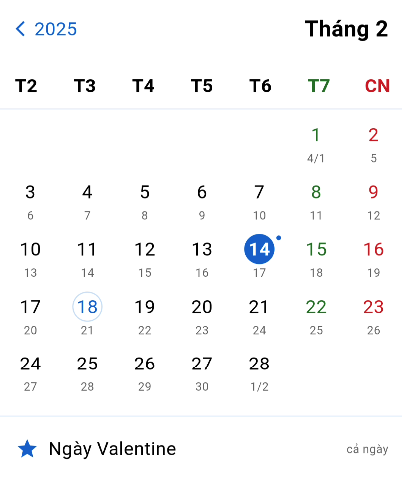

# Lunar Calendar

Package Flutter hỗ trợ lịch âm-dương với đầy đủ tính năng chọn ngày, quản lý sự kiện và hiển thị ngày lễ.



## Tính năng

### 1. Hiển thị Lịch
- Hiển thị song song cả ngày âm lịch và dương lịch
- Chế độ xem theo tháng/năm
- Điều hướng giữa các tháng/năm bằng nút hoặc vuốt
- Đánh dấu ngày hiện tại
- Hiển thị các thông tin phong thủy: Can chi, giờ hoàng đạo, ngày tốt/xấu

### 2. Chọn Ngày
- Chọn một hoặc nhiều ngày
- Chuyển đổi qua lại giữa ngày âm lịch và dương lịch
- Tìm kiếm nhanh ngày âm/dương lịch

### 3. Quản lý Sự kiện
- Thêm/sửa/xóa sự kiện cho ngày đã chọn
- Đặt nhắc nhở cho sự kiện
- Lặp lại sự kiện theo chu kỳ (hàng năm, hàng tháng)
- Xuất/nhập danh sách sự kiện

### 4. Ngày Lễ và Sự kiện Đặc biệt
Tự động đánh dấu và hiển thị:
- Tết Âm lịch và các ngày trong dịp Tết
- Rằm các tháng (15 âm lịch)
- Lễ hội truyền thống theo âm lịch
- Các ngày lễ theo dương lịch
- Các ngày cuối tuần

## Bắt đầu

### Yêu cầu
- Flutter SDK ≥ 2.5.0
- Dart SDK ≥ 2.14.0

### Cài đặt

Thêm dependency vào `pubspec.yaml`:

```yaml
dependencies:
  lunar_calendar: ^1.0.0
```

## Sử dụng

### Khởi tạo Calendar Widget cơ bản

```dart
LunarCalendar(
  initialDate: DateTime.now(),
  onDateSelected: (date) {
    print('Selected date: $date');
  },
)
```

### Thêm sự kiện

```dart
LunarCalendar(
  events: [
    LunarEvent(
      title: 'Giỗ ông',
      lunarDate: LunarDate(day: 15, month: 7, year: 2024),
      isYearlyRecurring: true,
    ),
  ],
)
```

### Tùy chỉnh giao diện

```dart
LunarCalendar(
  theme: LunarCalendarTheme(
    selectedDayColor: Colors.red,
    holidayTextStyle: TextStyle(color: Colors.red),
    weekendTextStyle: TextStyle(color: Colors.blue),
  ),
)
```

## API Reference

Xem tài liệu API đầy đủ tại [documentation](docs/API.md).

## Đóng góp

Chúng tôi rất hoan nghênh mọi đóng góp cho package. Bạn có thể:
- Báo lỗi hoặc đề xuất tính năng mới qua Issues
- Tạo Pull Request để cải thiện code
- Cải thiện tài liệu

## License

Package này được phát hành dưới [giấy phép MIT](LICENSE).
